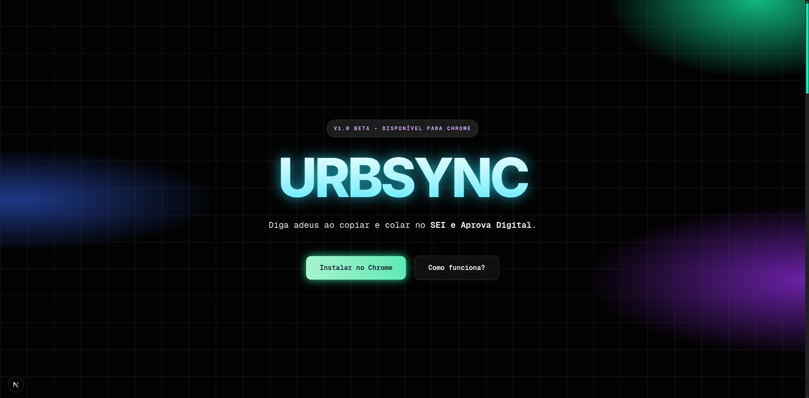

# UrbSync — Landing Page

<div align="center">



</div>

## 📌 Sobre

A **UrbSync** é uma extensão para o navegador Google Chrome voltada ao **serviço público**, com foco na automação da extração de dados dos portais **SEI** e **Aprova Digital**. Esta aplicação web é a **landing page** oficial do produto: apresenta a proposta de valor, o fluxo de uso em três passos e os campos extraídos automaticamente.

**Problema que resolve:** servidores e equipes técnicas perdem tempo com cópia manual entre abas, erros de digitação em relatórios e formatação repetitiva de planilhas ao consolidar informações desses sistemas.

**Objetivo principal:** comunicar de forma clara e visualmente impactante que a UrbSync **elimina o trabalho braçal** na coleta de dados, devolvendo tempo para análise e decisão — com instalação simples pela Chrome Web Store.

---

## 🛠️ Stack tecnológica

| Tecnologia | Versão (package.json) | Papel no projeto |
|------------|----------------------|------------------|
| **Next.js** | 16.x | Framework React com App Router |
| **React** / **React DOM** | 19.x | Interface declarativa e componentes |
| **TypeScript** | 5.x | Tipagem estática |
| **Tailwind CSS** | 4.x (`@tailwindcss/postcss`) | Estilização utilitária e tema |
| **Framer Motion** | 12.x | Animações de entrada, scroll e microinterações |

**Ferramentas de desenvolvimento:** ESLint (`eslint-config-next`), PostCSS com `@tailwindcss/postcss`, tipos Node/React.

> **Observação:** não há Radix UI, GSAP ou outras bibliotecas de componentes pesadas no `package.json` — a UI é composta com HTML semântico, Tailwind e Framer Motion.

---

## 🎨 UI/UX e design

- **Tema escuro** (`bg-black`, cards em `#151515` / `#101010`) com **grid de fundo** sutil e **gradientes radiais** no hero (esmeralda, azul e violeta) para profundidade sem poluir a leitura.
- **Tipografia:** **Inter** para títulos e hierarquia; **Geist Mono** no corpo e variáveis de fonte definidas em `layout.tsx` via `next/font/google`.
- **Paleta de destaque:** esmeralda (`emerald`), ciano, âmbar e rosa nos blocos de problema/solução — reforça contraste emocional (atrito × solução).
- **Glassmorphism:** `backdrop-blur`, bordas `border-white/10` e cards semi-transparentes para um visual moderno e leve.
- **Motion design:** variantes Framer Motion centralizadas em `app/animations/variants.ts` (transições tipo *spring*, *stagger* em listas, animações ao entrar na viewport) para uma sensação fluida e profissional.
- **Acessibilidade e detalhes:** scrollbar customizada em `globals.css`, âncoras no rodapé (`#features`), metadados SEO em português no `layout.tsx`.

---

## ✨ Funcionalidades (landing)

- **Hero** com badge de versão, título impactante, CTAs para instalação no Chrome e âncora “Como funciona”.
- **Seção Problema × Solução** em grid: três pares (caos do copia-e-cola, erros de digitação, relatórios manuais) contrastando com as respostas da UrbSync.
- **Funcionalidades em 3 passos:** instalação, extração automática nos portais, dados prontos em planilha (SEI e Aprova Digital, incluindo “Minha Caixa” e terceiros).
- **Showcase de campos:** lista visual dos campos mapeados (Sistema, Processo, Nº SEI, Requerimento, Requerente, etc.).
- **Sobre:** manifesto “de servidor para servidor”, destaque à **transparência no ecossistema** (links para repositório da extensão) e card do criador com links para repositório oficial, GitHub pessoal e Chrome Web Store.
- **Rodapé global:** marca UrbSync, links rápidos (Como funciona, Open Source, Instalar) e mensagem institucional.

---

## 📥 Instalação e uso

**Pré-requisitos:** [Node.js](https://nodejs.org/) (recomendado: LTS) e npm (ou yarn/pnpm/bun, conforme sua preferência).

1. **Clonar o repositório** (ajuste a URL conforme o remoto real):

   ```bash
   git clone https://github.com/victor-kiss/urbsync_lading_page.git
   cd <PASTA_DO_PROJETO>
   ```

2. **Instalar dependências:**

   ```bash
   npm install
   ```

3. **Ambiente de desenvolvimento:**

   ```bash
   npm run dev
   ```

4. Abrir no navegador: [http://localhost:3000](http://localhost:3000).

**Outros scripts úteis:**

| Comando | Descrição |
|---------|-----------|
| `npm run build` | Gera build de produção |
| `npm run start` | Sobe o servidor após o build |
| `npm run lint` | Executa o ESLint |

> O arquivo `next.config.ts` inclui `allowedDevOrigins` para desenvolvimento em rede local; ajuste o host conforme sua máquina, se necessário.

---

## 📁 Estrutura de pastas (simplificada)

```
urbsync_lp/
├── app/
│   ├── animations/
│   │   └── variants.ts      # Variantes Framer Motion (container, left, right)
│   ├── components/
│   │   ├── about.tsx        # Sobre + card do criador
│   │   ├── features.tsx     # 3 passos + grid de campos extraídos
│   │   ├── hero.tsx         # Hero principal
│   │   └── problemSolution.tsx
│   ├── globals.css          # Tailwind v4 + scrollbar + @theme
│   ├── layout.tsx           # Fontes, metadata, footer
│   └── page.tsx             # Composição da home e dados das seções
├── public/
│   └── icon128.png          # Ícone / asset público
├── next.config.ts
├── package.json
├── postcss.config.mjs
└── tsconfig.json
```

---

## 📄 Licença

**Titular dos direitos e propriedade intelectual:** Victor Kiss (doravante “Titular”), em nome do projeto **UrbSync**.

A **propriedade intelectual** sobre este repositório abrange, sem limitação: código-fonte, arquitetura, textos, layout, identidade visual, marcas, nomes comerciais, documentação, fluxos de interface e demais criações incorporadas — no conjunto denominado “Obra”.

A Obra é **propriedade exclusiva do Titular** e reveste-se de proteção legal aplicável (direitos autorais e conexos, e demais normas de propriedade intelectual). O Titular **não transfere** ao visitante ou a terceiros qualquer direito de propriedade intelectual, licença ou cessão, salvo o que for **expressamente autorizado por escrito**.

Este repositório e seu conteúdo são disponibilizados **somente para consulta** na forma em que aparecem publicamente.

**É vedado**, sem autorização **prévia, expressa e por escrito** do Titular:

- copiar, modificar, mesclar, publicar, distribuir, sublicenciar ou vender cópias da Obra ou de partes substanciais;
- utilizar o projeto, a ideia, o fluxo ou o posicionamento comercial para **lucro próprio** ou de terceiros em concorrência ou substituição da solução original;
- fazer engenharia reversa com fins de reprodução comercial ou de produto derivado sem acordo formal.

O não exercício ou a tolerância quanto a qualquer direito **não constitui renúncia** nem licença tácita. Para uso comercial, parcerias ou licenciamento de **propriedade intelectual**, entre em contato com o **Titular**.

```
Copyright (c) UrbSync / Victor Kiss — Titular dos direitos — Todos os direitos reservados.

Propriedade intelectual protegida. Licença proprietária. Uso, cópia, modificação
e distribuição não autorizados estão proibidos, exceto mediante autorização expressa
e por escrito do titular dos direitos de propriedade intelectual.
```

---

*Desenvolvido para transformar o serviço público — landing page da UrbSync.*
